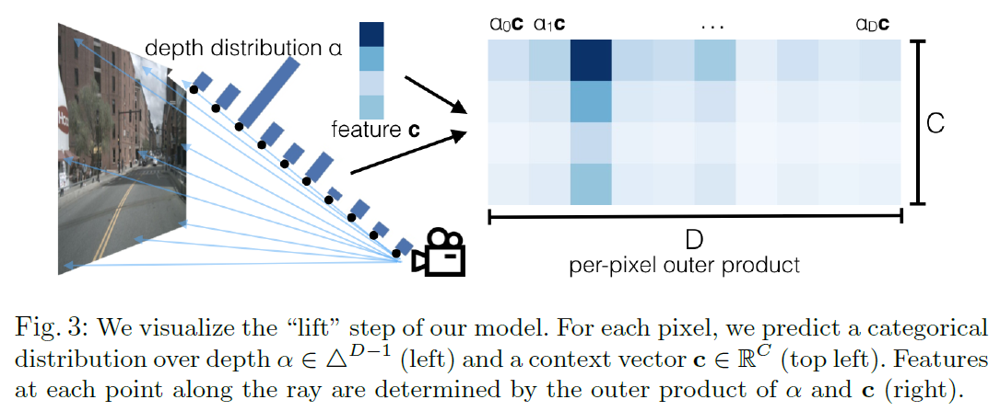

# 1. Introduction
자율주행 기술은 크게 세 가지 스텝으로 이루어진 pipeline 구조로 설계되어있습니다.(그 이후의 paradigm인 E2E는 관련 포스팅에서 다룹니다)
1. 인지(Perception)
2. 판단(Decision)
3. 제어(Control)

Computer vision은 이 파이프라인 중에 인지 부분을 담당하고 여러 센서에 대한 의존도가 높습니다. 많은 완성차 업체들에서는 센서로 camera, LiDAR, RADAR을 사용하고 있는데, 그중 단연코 많이 사용하는 센서는 단가가 저렴한 camera입니다.

하지만, 이런 camera도 치명적인 단점이 있는데, 자동차 기준 설치된 위치가 달라짐에 따라(calibration 값이 맞지 않게 됨에 따라) camera 기반 인지 성능이 열화되는 단점이 있습니다. 이러한 단점을 극복하기 위해선 인지 파이프라인은 다음과 같은 세가지 특성을 만족해야 합니다.

1. Translation Equivariance
2. Permutation Invariance
3. Ego-frame Isometry Equivariance

이 세가지를 만족하는 image encoding 기법과 함께, 이를 바탕으로 얻어낸 BEV feature로 차량 trajectory를 예측하는 방법을 본 논문에서 소개하고 있습니다.

# 2. Method
방법론은 논문 제목에서도 확인할 수 있듯 세가지로 구성되어 있습니다.
1. Lift: 2차원 feature 3차원 frustum 형태로 **띄우기**
2. Splat: 3D feature ➡ 2D BEV feature로 **뿌리기**
3. Shoot: BEV feature로 예상 차량 trajectory **쏘기**(?)

각각의 절차를 아래에서 자세히 알아보겠습니다.
## 1. Lift

Lift 단계에서는 2D image feature로 부터 같은 해상도의 두 가지 feature를 예측합니다. 

- Depth Distribution
- Context

그리고 나서 이 둘을 외적하여 하나의 3D frustum(절두체, 피라미드에서 위 사각기둥을 절단한 모양의 도형) feature를 얻습니다.

## 2. Splat
이렇게 얻어낸 임의의 camera rig들에서 얻어진 feature를 extrinsic으로 ego 좌표계로 transform 합니다.

3차원의 feature는 z방향(ego vehicle의 윗 방향)으로 흩어진 feature를 모두 sum pooling 해서 2D화 합니다.

## 3. Shoot
